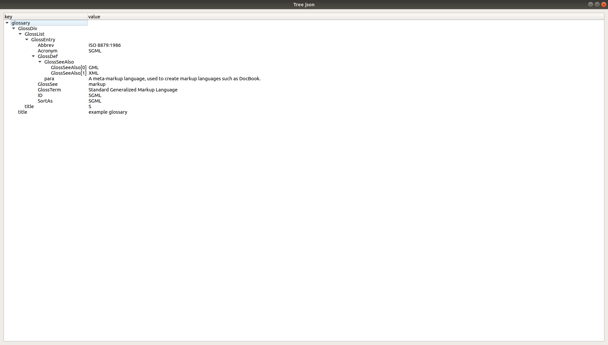

# Отображение json формата в иерархической модели

Запуск программы:
```
Использование: ./jsontreemodel [параметры]

Параметры:
  -p, --path <path>  Path to json file
  -h, --help         Prints help text and exit
```

